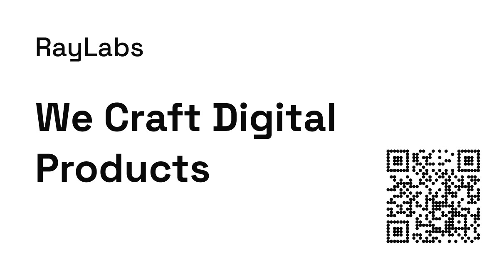

# RayLabs 🚀

Timeless design • Pragmatic engineering • Rapid iteration  
We build web & SaaS products that feel effortlessly polished.

<picture>
  <source srcset="./og-image-dark.png" media="(prefers-color-scheme: dark)" />
  <source srcset="./og-image-light.png" media="(prefers-color-scheme: light)" />
  
</picture>

## What We Do

- **Product Strategy & UX** – turning fuzzy ideas into clear roadmaps  
- **Full-Stack Development** – React / TypeScript / Next.js & friends  
- **Performance & DevOps** – speed, reliability, and sane ops from day 1  
- **In-House Experiments** – a growing suite of micro-SaaS tools

## Right Now

We’re:
- Shipping our own browser-based utilities and API-backed services  
- Partnering with a handful of teams to accelerate their launches  
*(Details under wraps until they land—stay tuned!)*

🌐 **Website** – [raylabs.io](https://raylabs.io)

Made with care by the RayLabs crew.
