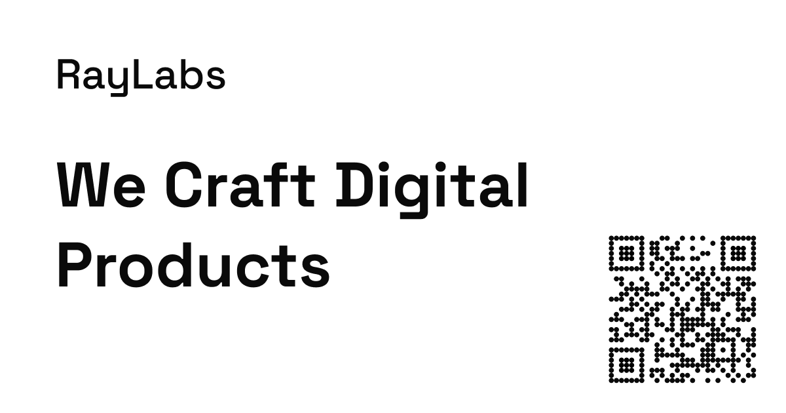
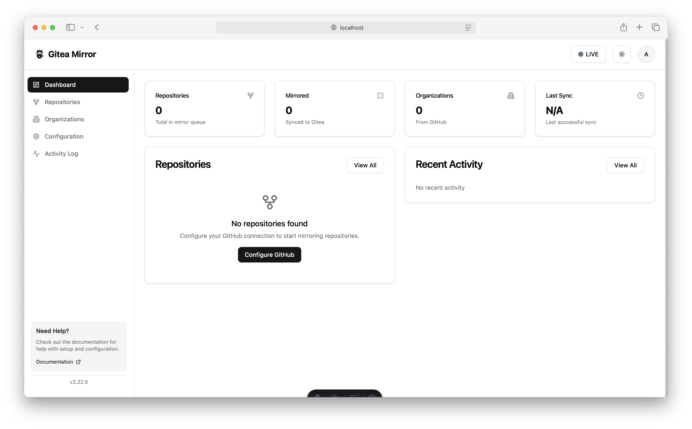
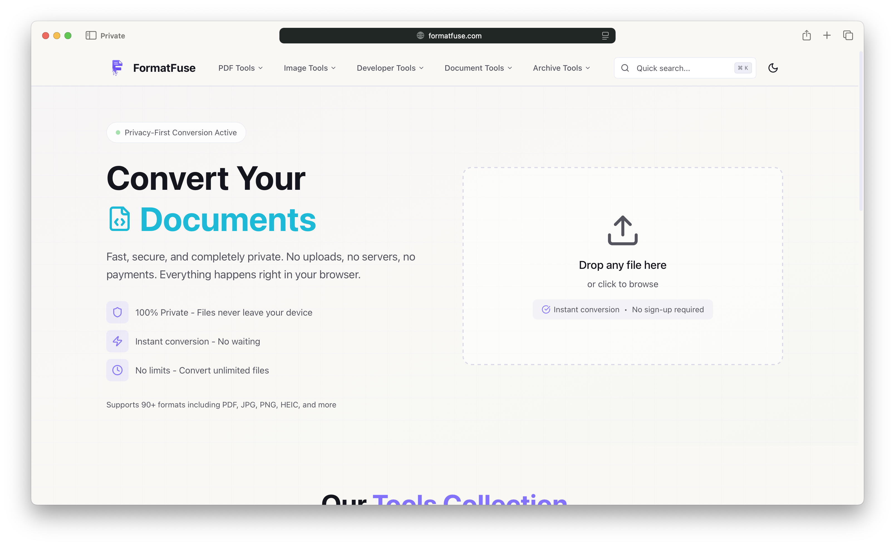

# RayLabs 🚀

<a href='https://raylabs.io'>
  <picture>
    <source srcset="./og-image-dark.png" media="(prefers-color-scheme: dark)" />
    <source srcset="./og-image-light.png" media="(prefers-color-scheme: light)" />
    
  </picture>
</a>

## What We Do

- **Product Strategy & UX** – turning fuzzy ideas into clear roadmaps  
- **Full-Stack Development** – React / TypeScript / Next.js & friends  
- **Performance & DevOps** – speed, reliability, and sane ops from day 1  
- **In-House Experiments** – a growing suite of micro-SaaS tools

## Products

### [Gitea Mirror](https://github.com/RayLabsHQ/gitea-mirror)

Automatically mirror repositories from GitHub to your self-hosted Gitea instance. Features real-time syncing, organization support, and a beautiful dashboard.

<a href='https://github.com/RayLabsHQ/gitea-mirror'>
  <picture>
    <source srcset="./products/gitea-mirror/dashboard.png" media="(prefers-color-scheme: dark)" />
    <source srcset="./products/gitea-mirror/dashboard-light.png" media="(prefers-color-scheme: light)" />
    
  </picture>
</a>

### [Format Fuse](https://formatfuse.com/)

Fast, secure, and completely private browser tools. No uploads, no servers, no payments. Everything happens right in your browser.

<a href='https://formatfuse.com/'>
  <picture>
    <source srcset="./products/formatfuse/formatfuse-dark.png" media="(prefers-color-scheme: dark)" />
    <source srcset="./products/formatfuse/formatfuse-light.png" media="(prefers-color-scheme: light)" />
    
  </picture>
</a>

🌐 **Website** – [raylabs.io](https://raylabs.io)

Made with care by the RayLabs crew.
